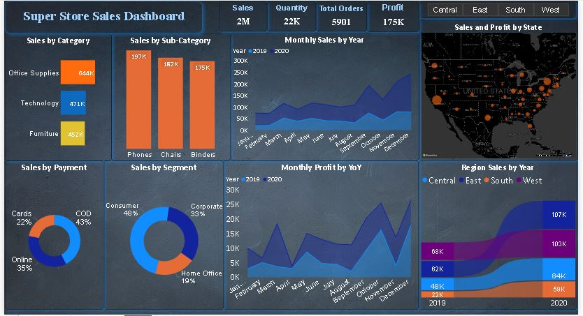
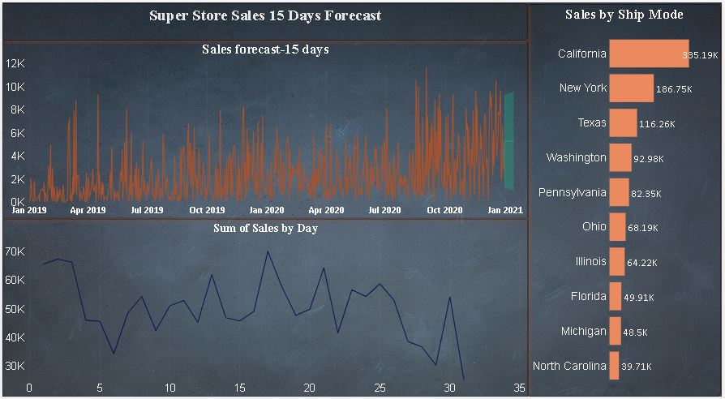

# Super Store Sales
## Introduction
The Sales Superstore Dashboard project aims to analyze and visualize the sales performance of a USA company using the Sales Superstore dataset of two years using Power BI. 
This dynamic dashboard uncovers actionable insights in sales trends, customer behavior, product performance, geography, orders, shipping, and profitability, empowering businesses to optimize sales, improve customer management, and drive growth.
## Objective
- To contribute to the success of business by utilizing data analysis techniques,specifically focusing on time series analysis, to provide valuable insights and accuaret sales forecasting.

## Data Description

Column Name     | Description
----------------|-------------------------------------
Order ID        | Unique identifier for each order
Order Date      | The date when the order was placed
Ship Date       | The date when the order was shipped
Ship Mode       | The mode of shipment for the order
Customer ID     | Unique identifier for each customer
Customer Name   | Name of the customer
Segment         | Market segment to which the customer belongs
City            | City where the customer is located
State           | State where the customer is located
Country         | Country where the customer is located
Region          | Region where the customer is located
Product ID      | Unique identifier for each product
Category        | Category of the product
Sub-Category    | Sub-category of the product
Product Name    | Name of the product
Sales           | Total sales revenue for the order
Quantity        | Quantity of products ordered
Profit          | Profit earned from the order
Returns         | product returned or not
Payment Mode    | mode of payment for the order

## Methodology

- **Dataset Preparation**: The Superstore sales data is obtained and imported into Power Query Editor for data cleaning and transformation.

- **Data Cleaning and Transformation**: Using Power Query, the data is cleaned by filtering out unnecessary data, and handling missing values. Transformation is done  to ensure the data is in a suitable format for analysis.

- **Dashboard Creation**:  After preparing and loading the cleaned dataset into Power BI, we craft an engaging and visually captivating dashboard. This involves incorporating a range of visual elements like charts and graphs to effectively convey essential insights derived from the sales data.

- **User-Friendly Filters**: The dashboard includes interactive filters, enabling users to easily slice and dice the data as per their preferences.

- **Data Enhancement with DAX**: Leveraging DAX (Data Analysis Expressions), calculated measures like average delivery days are generated to extract further valuable insights from the dataset.

## Results

- Among all the states, California exhibits the highest sales.

- The customer on an average get the order in 4 days.

- The sales from september to december is high with december having highest sales while profit is maximum in march ,october and december month.

- The customers mostly prefers cash on delivery as payment method and least by cards .Store can give offers for cards  to increase that method sales also.

- The most sales is done in West region. and least in the South. 

- The consumer segment demonstrates the highest sales volume, followed by the corporate segment, and finally the home office segment.

- The product with maximum profit in the dataset is the Canon imageCLASS 2200 Advanced Copier. Conversely, the Cubify CubeX 3D Printer Doouble Head Print is identified as the product with the highest loss, negatively impacting overall profitability.

## Learning
- Incorporated data analysis techniques,specializing in **time series analysis**,to deliver valuable **insights**,accurate **sales forecasting** and **interactive dashboard** creation,driving business success.

